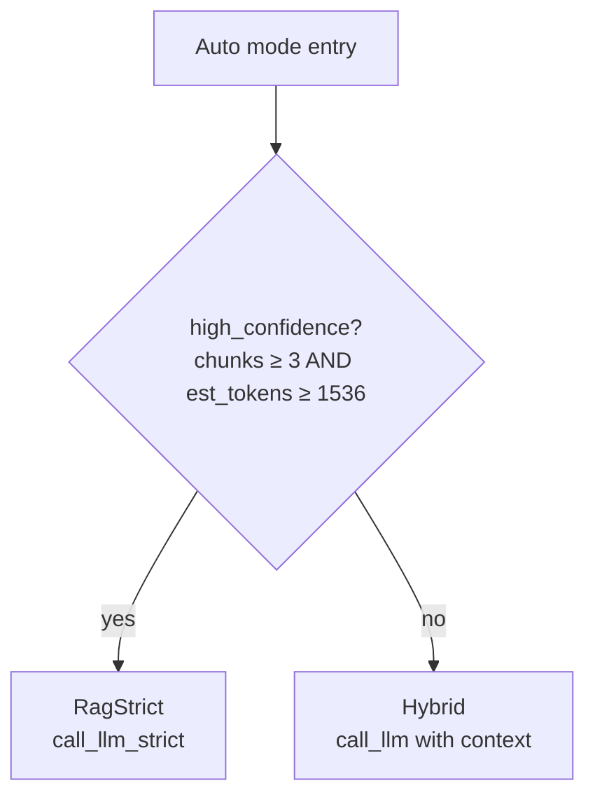
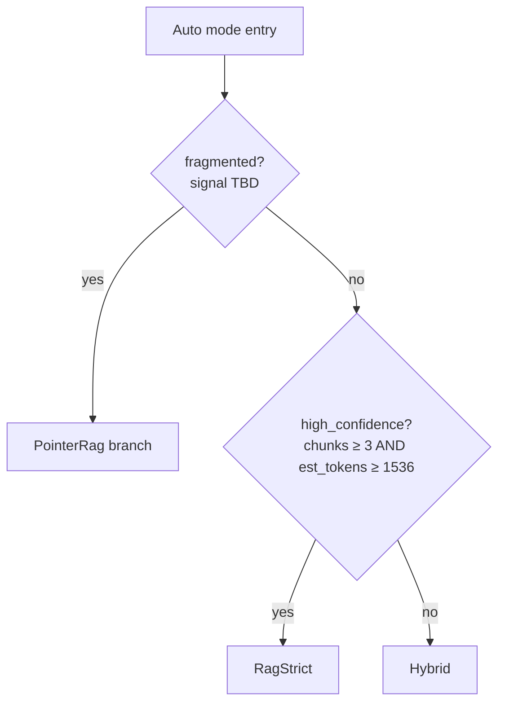

# Plan: Draft PointerRag auto-trigger design entry into the followups doc

## Context

The Pointer RAG info modal currently reads:

> "Pick this mode when you expect retrieval to land on fragments — single
> chunks that miss the surrounding paragraph, table row, or list item the
> answer needs. The app then reassembles every matched chunk's full
> section. There's no per-query heuristic — selecting Pointer is the
> decision."

That last sentence is the honest part. Auto mode (`backend/src/agent.rs:743`)
*does* make a per-query routing decision —
`used_chunks.len() >= 3 && (context.len() / 4) >= 1536` selects between
`RagStrict` and `Hybrid`. Pointer mode has no equivalent: it's user-as-router.

Earlier conversation surfaced two responses:
1. Clarify the modal copy ("Choose this when…") — trivial, separate task.
2. Add an auto-trigger that routes to PointerRag when matched chunks look
   fragmented (e.g. many distinct `section_id`s).

This plan is **only for #2**, and only to capture the design questions in
the followups doc — not to implement, not to decide. Implementation belongs
in a later PR once the questions below have answers.

## Approach

Append one new entry to `docs/proxy-pointer-rag-followups.md` under the
**Bundle-adjacent** section (where the chat-UI toggle entry already
lives — same shape: what's missing, where it would live, what we'd need to
decide).

### Where the trigger fits

The current Auto-mode flow at `agent.rs:740-769` is a single binary on
context size:

The auto-trigger would slot in *before* that gate, because fragmentation is
orthogonal to confidence — a high-confidence retrieval that's spread across
many sections is exactly the case Pointer is designed for, and a
low-confidence retrieval that's all in one section is not.

The followups entry should show this shape so a future implementer
doesn't re-derive it.

### Open design questions to record

1. **Signal.** Candidates, ordered by how cheap they are with existing code:
   - `unique_section_ids / chunk_count` ratio (high = fragmented). The
     `Retriever::meta_for_content` lookup already used at `agent.rs:787`
     gives `section_id` per chunk, so this is computable without new
     retrieval work.
   - Score spread across top-k (wide spread = weak coherence).
   - Section-span coverage: do the chunks cluster at the boundaries of
     their sections (suggesting the section body is what's wanted)?
   - Or some combination.
2. **Threshold.** What ratio / count actually correlates with Pointer
   beating Hybrid? Needs corpus data, not a guess. Note this in the entry
   as "needs measurement before picking a number" so it doesn't get a
   placeholder default that calcifies.
3. **UX.** Three options, list all three; don't pick:
   - Silent switch (matches today's Auto behavior of just logging the
     branch taken in the step trace).
   - Step-trace hint only ("retrieval looks fragmented — Pointer would
     reassemble these N sections") with no automatic switch.
   - Suggest-in-UI: a one-click "Try Pointer" affordance when the signal
     fires, leaving the user as decision-maker.
4. **Composition with existing Auto switch.** Spell out that fragmentation
   check runs first (per the diagram above), and that high_confidence is
   only consulted on the non-fragmented branch.
5. **Educational surface.** CLAUDE.md frames ag as a learning platform —
   "make the invisible visible". Whichever UX option wins, the *signal
   value* (e.g. "5 chunks → 5 sections, fragmentation 1.0") should appear
   in the step trace so the user can see why the router chose what it
   chose. Matches the existing PointerRag step message at
   `agent.rs:781-783` (hydrated/fallback counters).

### What does not belong in this entry

- Picking the signal, threshold, or UX. The user explicitly framed step 2
  as design-doc work, not implementation.
- Modal copy rewording — that's step 1, a separate change.
- Renaming or refactoring the existing `high_confidence` check.

## File to modify

- `docs/proxy-pointer-rag-followups.md` — append one new subsection under
  the existing `## Bundle-adjacent` heading (currently contains only
  "Frontend chat-UI toggle for PointerRag mode" at line 49). New subsection
  heading: `### PointerRag auto-trigger from fragmentation signal`. Match
  the prose voice of the existing entries: what's missing, why it isn't
  shipping now, what would need deciding when it does.

Include the second mermaid diagram from above inline in the entry so the
"runs before high_confidence" placement is verifiable at a glance.

Cross-reference the two anchor lines so the entry stays useful as the file
moves: `backend/src/agent.rs` Auto branch (currently 740-769) and Pointer
section-id lookup (currently 770-799).

## Verification

- `grep -n "PointerRag auto-trigger" docs/proxy-pointer-rag-followups.md`
  shows the new subsection.
- Open `docs/proxy-pointer-rag-followups.md` and confirm: entry sits under
  `## Bundle-adjacent`, mermaid renders (or at least reads cleanly as a
  fenced block), all referenced line numbers exist in `agent.rs`.
- No code changes — `cargo fmt` / `cargo clippy` / tests are not required
  for this PR. A docs-only PR is the deliverable.
