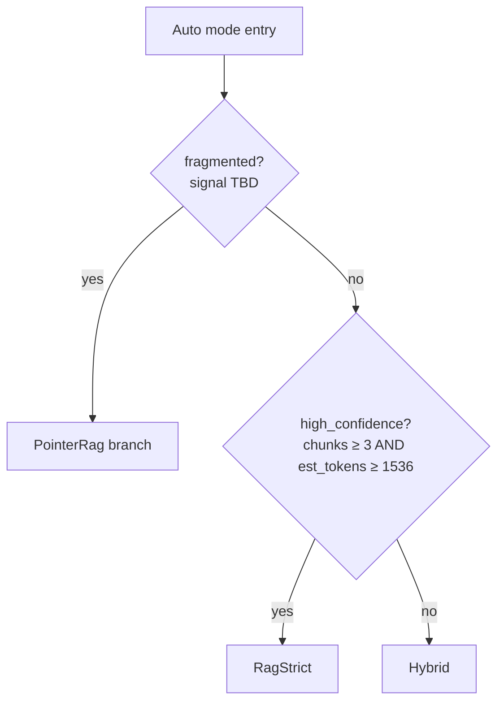

# Proxy-pointer RAG bundle — followups

Things the bundle (`feat/proxy-pointer-rag`) does not ship and the reasons
why, captured at PR time so they don't get forgotten. Each entry says what,
where, and what changed our minds about the priority.

## Bundle-scope leftovers

### Reconciler auto-merge threshold ceiling

`RECONCILER_AUTO_MERGE_THRESHOLD` defaults to `0.92`. The cosine-probe
diagnostic in `entity_reconciler::tests::probe_reconciler_cosines` showed
`"Sony Corp (ORG)"` vs `"Sony Interactive Entertainment (ORG)"` at
**0.9204** — just barely above the threshold, despite being legitimately
distinct corporate entities (parent vs subsidiary brand). The reconciler
will auto-merge them without LLM review.

Two ways to address:
- Bump default to `0.95` (pushes SIE-style pairs to LLM tiebreak, costs an
  Ollama call per borderline candidate).
- Accept the false-positive risk and let users tune via overrides.

Not a blocker — `RECONCILER_ENABLED` is off by default so no current user
is affected. Worth revisiting once we have real-corpus data on how often
0.92–0.95 pairs occur.

### Explicit RECONCILER_ENABLED propagation verification

The Hitachi smoke confirmed the reconciler fires when
`RECONCILER_ENABLED=true` is set in `overrides.json` (debug stats logged
per doc, full-schema entities written). But the verification was
implicit. The earlier session-state where it appeared *not* to fire was
explained by the vector-binding bug (writes failed silently at the
FalkorDB layer, not at the wiring layer).

If anyone sees similar "reconciler appears disabled despite override" in
the future, the first check is to confirm at least one entity has the
reconciler-only fields (`aliases`, `embedding`, `definition_snippet`):

```bash
redis-cli -p 6380 -a ${FALKOR_PASSWORD} --no-auth-warning \
  GRAPH.QUERY ag "MATCH (e:Entity) WHERE e.aliases IS NOT NULL RETURN count(e)"
```

A count > 0 proves the reconciler ran.

## Bundle-adjacent

### Frontend chat-UI toggle for PointerRag mode

Backend mode is wired (`AgentMode::PointerRag`, `ChatMode::PointerRag`
plus `"pointer_rag"` string alias), but no chat-UI button. Currently only
reachable via direct API call with `mode=pointer_rag`.

Anchor: `frontend/fro/src/components/home_settings_boards.rs` — TODO
comment placed between the Agentic and Tune buttons. Copy the RAG Strict
button pattern (line 186 in that file at time of writing).

### PointerRag auto-trigger from fragmentation signal

The Pointer RAG info modal is honest about Pointer being user-as-router:
"There's no per-query heuristic — selecting Pointer is the decision."
Auto mode (`backend/src/agent.rs:740-769`) *does* make a per-query
routing decision — `used_chunks.len() >= 3 && (context.len() / 4) >= 1536`
picks between `RagStrict` and `Hybrid`. Pointer has no equivalent.

A natural extension is to add a fragmentation check that routes to
PointerRag automatically, before the existing high-confidence check:



Fragmentation runs first because it's orthogonal to confidence: a
high-confidence retrieval spread across many sections is exactly the
case Pointer is designed for, and a low-confidence retrieval all in
one section is not.

Open design questions to settle before implementing:

1. **Signal.** Candidates, ordered by how cheap they are with the
   existing code:
   - `unique_section_ids / chunk_count` ratio (high = fragmented).
     `Retriever::meta_for_content` (already used at
     `backend/src/agent.rs:770-836` for the Pointer section lookup)
     gives `section_id` per chunk — computable without new retrieval
     work.
   - Score spread across top-k (wide spread = weak coherence).
   - Section-span coverage: do chunks cluster at section boundaries
     (suggesting the body is what's wanted)?
   - Or some combination.
2. **Threshold.** What ratio / count actually correlates with Pointer
   beating Hybrid? Needs measurement against a real corpus before
   picking a number — a placeholder default will calcify.
3. **UX.** Three options, all viable:
   - Silent switch (matches today's Auto behavior — just log the branch
     taken in the step trace).
   - Step-trace hint only ("retrieval looks fragmented — Pointer would
     reassemble these N sections") with no automatic switch.
   - Suggest-in-UI: one-click "Try Pointer" affordance when the signal
     fires, leaving the user as decision-maker.
4. **Composition with the existing Auto switch.** Fragmentation check
   runs first per the diagram above; `high_confidence` is only consulted
   on the non-fragmented branch.
5. **Educational surface.** CLAUDE.md frames ag as a learning platform —
   "make the invisible visible". Whichever UX wins, the *signal value*
   (e.g. "5 chunks → 5 sections, fragmentation 1.0") should appear in
   the step trace so the user can see why the router chose what it
   chose. Same shape as the hydrated/fallback counters now emitted by
   the PointerRag branch.

## Out-of-bundle bugs surfaced

### Runtime overrides → process env propagation gap

`docs/runtime-config.md` advertises `RUST_LOG` as hot-reload-capable. The
smoke session showed that setting `RUST_LOG` in `overrides.json` and
restarting **does not** propagate to `EnvFilter::try_from_default_env()`
at startup. The override is read into the in-memory settings store, but
the tracing subscriber was already initialized from the env-only value.

Reliable workaround: set `RUST_LOG` in `~/.config/ag/ag.env` (the
systemd `EnvironmentFile=`) and restart. Verified to propagate to
`/proc/$PID/environ`.

Fix shape (separate PR): the tracing subscriber should re-init from
`settings::effective_or("RUST_LOG", "info")` rather than reading the
process env directly, and subscribe to settings changes for hot reload.

## Architecture conversation

### Vector store proliferation

ag currently maintains vectors in:
- Tantivy + a rkyv-serialized vector file (chunk embeddings, the
  retrieval primary path)
- In-memory HNSW / PQ indexes built on top (Phase 14/19)
- FalkorDB `:Entity(embedding)` vector index (this bundle, for the
  reconciler)
- `./lancedb/` directory remains in tree but no `lance` crate dependency
  exists — see `project_lancedb_vestigial` memory entry

Every new feature that wants semantic similarity has a choice of three
backends, and the bundle picked FalkorDB because the data it queries
already lives there. That's locally correct but accelerates the
fragmentation. Worth a focused conversation before adding a fourth user.

Not actionable in this PR. Worth a design doc when the next vector
feature lands and we have a concrete choice to make.
